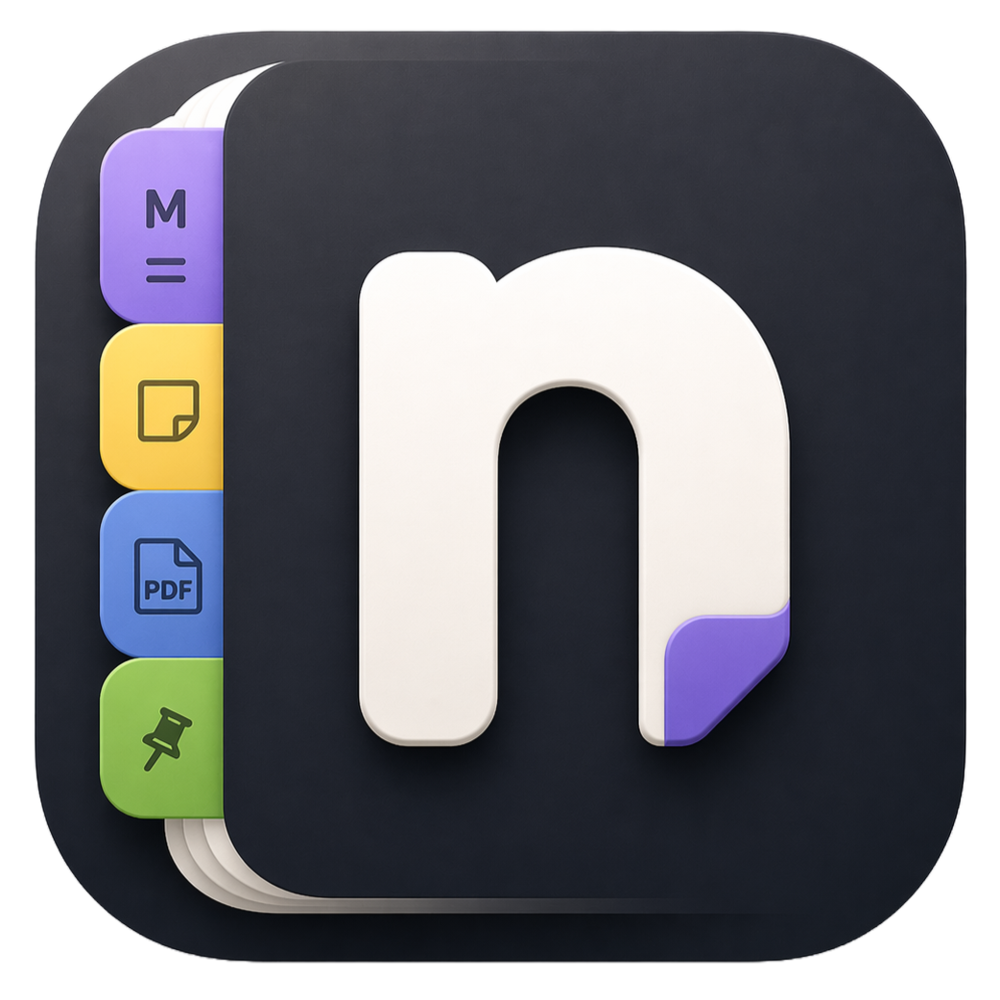

<p align="center">
  
</p>

<h1 align="center">Notiq</h1>

<p align="center">
  A fast, local-first Markdown editor, whiteboard, and knowledge graph for your desktop.<br/>
  Built with <strong>Tauri v2</strong>, <strong>React 18</strong>, and <strong>Monaco</strong>.
</p>

<p align="center">
  No cloud. No accounts. No telemetry. Everything lives on your machine.
</p>

---

## Why Notiq?

Most note-taking apps either lock you into a cloud ecosystem or sacrifice power for simplicity. Notiq gives you the full Monaco editor (the same engine behind VS Code), an Excalidraw whiteboard, a 3D knowledge graph, and an embedded terminal — all in a single offline desktop app that starts in under a second. Your files stay on your disk as plain Markdown. Nothing leaves your machine.

---

## Features

### Markdown Editor

- **Monaco-powered** — syntax highlighting, multi-cursor editing, find/replace, code folding, bracket matching, and every keyboard shortcut you already know from VS Code
- **Three view modes** — Source (raw Markdown), Preview (rendered HTML), or Split (side-by-side with synchronized scrolling)
- **Formatting toolbar** — one-click buttons for bold, italic, headings, lists, tables, code blocks, blockquotes, links, images, and more
- **GFM support** — GitHub Flavored Markdown including tables, task lists, and strikethrough
- **Mermaid diagrams** — render flowcharts, sequence diagrams, and Gantt charts inside fenced ` ```mermaid ``` ` code blocks
- **LaTeX math** — write equations with `$inline$` and `$$block$$` syntax, rendered via KaTeX
- **Syntax highlighting** — code blocks highlighted for 180+ languages
- **Wiki-links** — link notes using `[[Note Title]]` syntax; links resolve across all open tabs
- **Admonitions** — GitHub-style alert blocks (`> [!NOTE]`, `> [!WARNING]`, etc.)
- **Prettier auto-format** — clean up your Markdown structure with a single click
- **Live word count** — character and word count displayed in the status bar

### Multi-Tab Workflow

- **Unlimited tabs** — open as many notes and whiteboards as you need
- **Drag-to-reorder** — rearrange tabs by dragging them in the tab bar
- **Tab pinning** — pin important tabs to prevent accidental closure
- **Unsaved-changes detection** — dot indicator on dirty tabs with a confirmation dialog on close
- **Session persistence** — all open tabs, their content, cursor positions, and scroll state are saved to IndexedDB and restored on next launch
- **Quick navigation** — jump to any tab with `Ctrl+1` through `Ctrl+9`

### File System

- **Open files** — single or multiple files at once (`Ctrl+O`)
- **Open folder** — recursively load all Markdown and text files from a directory (`Ctrl+Shift+O`)
- **File selection modal** — when opening many files, pick exactly which ones to load and preview the folder tree
- **Drag & drop** — drop files from Explorer/Finder directly onto the window to open them as tabs
- **Save / Save As** — write directly to your local filesystem via Tauri's FS plugin
- **Export PDF** — print the rendered preview to PDF (`Ctrl+P`)
- **File associations** — register `.md`, `.markdown`, `.txt`, and `.notiq` extensions so files open directly in Notiq from Explorer or Finder
- **Windows shell integration** — adds "Open with Notiq" to the right-click menu for any file, plus "Open folder in Notiq" on directories

### Whiteboard

- **Excalidraw integration** — full hand-drawn style canvas for sketching, diagramming, and brainstorming
- **Per-tab persistence** — whiteboard drawings are saved automatically and restored when you reopen the tab
- **Linked whiteboards** — attach a whiteboard to a specific note and navigate between them with one click
- **Library panel** — save custom shapes and browse the official Excalidraw component library

### Knowledge Graph

- **3D visualization** — interactive force-directed graph showing all open notes as nodes and their connections as edges
- **Auto-detected links** — edges drawn for both `[text](Target Note)` markdown links and `[[Target Note]]` wiki-links
- **Click-to-navigate** — click any node to jump directly to that note in split view
- **Live updates** — the graph rebuilds automatically as note content or titles change
- **Themed colors** — node colors adapt to your current theme

### Embedded Terminal

- **Built-in terminal** — resizable panel at the bottom of the window powered by xterm.js
- **Native shell** — spawns PowerShell on Windows, bash or zsh on macOS/Linux via a real PTY
- **Multi-session tabs** — open multiple shells side-by-side and switch between them
- **Theme-aware** — the terminal palette (foreground, background, ANSI 16) tracks the active app theme
- **Configurable** — adjust font size, cursor style, blinking, and scrollback buffer in Settings
- **Shortcuts** — `Ctrl+` `` ` `` toggles the panel, `Ctrl+Shift+` `` ` `` opens a new session

### Sticky Notes

- **Floating windows** — create small, always-visible notes that live on your desktop as separate windows
- **Monaco-powered** — every sticky note runs the same editor as the main app
- **Independent persistence** — each sticky note is saved and restored individually
- **Sticky notes list** — dedicated window listing all your sticky notes, with search and quick reopen
- **Quick access** — launch new sticky notes or open the list from the system tray menu

### System Tray

- **Minimize to tray** — keep Notiq running in the background
- **Quick actions** — show/hide the main window, create sticky notes, or quit from the tray icon
- **Single instance** — opening a file with Notiq reuses the existing window instead of launching a duplicate

### Themes

Thirteen built-in color themes — switch instantly from the sidebar or Settings (`Ctrl+,`):

| Theme | Style |
|---|---|
| Dark | Default dark with warm amber accent |
| Light | Clean, high-contrast light mode |
| One Dark Pro | Atom-inspired dark palette |
| Nord | Arctic, north-bluish tones |
| Dracula | Purple and pink dark theme |
| Catppuccin Mocha | Pastel dark with lavender highlights |
| Tokyo Night | Deep blue Japanese-inspired dark theme |
| Rose Pine | Muted, elegant dark with rose and pine accents |
| Gruvbox Dark | Retro, warm beige-on-brown |
| Solarized Dark | Classic Ethan Schoonover palette |
| GitHub Dark | GitHub's official dark theme |
| Monokai Pro | Modern take on the original Monokai |
| Kanagawa | Japanese woodblock-inspired tones |

### Settings (`Ctrl+,`)

Extensive editor customization:

- **Font** — size (8–32 px), family (JetBrains Mono, Fira Code, Cascadia Code, Consolas, Courier New)
- **Editor** — word wrap, line numbers, minimap, bracket colorization, cursor style & blinking, auto-closing brackets, whitespace rendering, smooth scrolling, folding, format on paste
- **Tab behavior** — tab size (2–8 spaces), default editor mode for new tabs
- **Terminal** — font size, cursor style, cursor blinking, scrollback buffer size

---

## Getting Started

### Prerequisites

- [Node.js](https://nodejs.org/) 18+
- [Bun](https://bun.sh/) — package manager and script runner
- [Rust](https://www.rust-lang.org/tools/install) + Cargo
- [Tauri v2 prerequisites](https://tauri.app/start/prerequisites/) for your OS (WebView2 on Windows)

### Install

```bash
git clone <repo-url>
cd smart-note
bun install
```

### Run in development

```bash
bun run tauri dev
```

Starts the Vite dev server on `http://localhost:1420` and opens the Tauri window with hot module replacement.

### Build for production

```bash
bun run tauri build
```

The installer is output to `src-tauri/target/release/bundle/`.

### Cross-compile a Linux build (from Windows/macOS)

```bash
bun run build:linux
```

Spins up a Docker container (defined in `docker/Dockerfile.linux`) that produces `.deb` and `.AppImage` artifacts in `dist-linux/`. Requires Docker Desktop.

---

## Keyboard Shortcuts

### File

| Shortcut | Action |
|---|---|
| `Ctrl+N` | New note |
| `Ctrl+W` | Close current tab |
| `Ctrl+S` | Save file |
| `Ctrl+Shift+S` | Save As |
| `Ctrl+O` | Open file(s) |
| `Ctrl+Shift+O` | Open folder |
| `Ctrl+P` | Export PDF |
| `Ctrl+3` | New whiteboard |
| `Ctrl+,` | Open Settings |

### Tabs

| Shortcut | Action |
|---|---|
| `Ctrl+Tab` | Next tab |
| `Ctrl+Shift+Tab` | Previous tab |
| `Ctrl+1` … `Ctrl+9` | Jump to tab N |

### Terminal

| Shortcut | Action |
|---|---|
| `` Ctrl+` `` | Toggle terminal panel |
| `` Ctrl+Shift+` `` | Open terminal and start a new session |

### Editor

| Shortcut | Action |
|---|---|
| `Ctrl+/` | Toggle line comment |
| `Ctrl+D` | Duplicate line down |
| `Shift+Alt+Up/Down` | Copy line up / down |
| `Alt+Up/Down` | Move line up / down |
| `Ctrl+Shift+K` | Delete line |
| `Ctrl+L` | Select line |
| `Ctrl+Shift+L` | Select all occurrences |
| `Ctrl+]` / `Ctrl+[` | Indent / Outdent |
| `Ctrl+F` | Find |
| `Ctrl+H` | Find and replace |
| `Ctrl+G` | Go to line |
| `Ctrl+Scroll` | Zoom font size |

### Markdown Formatting

| Shortcut | Action |
|---|---|
| `Ctrl+B` | Bold |
| `Ctrl+I` | Italic |
| `Ctrl+Shift+X` | Strikethrough |
| `Ctrl+E` | Inline code |
| `Ctrl+K` | Insert link |
| `Ctrl+Alt+1` / `2` / `3` | Heading 1 / 2 / 3 |
| `Ctrl+Shift+8` | Bullet list |
| `Ctrl+Shift+7` | Ordered list |
| `Ctrl+Shift+9` | Task list |
| `Ctrl+Shift+.` | Blockquote |
| `Ctrl+Alt+C` | Code block |
| `Ctrl+Shift+T` | Table |

---

## Tech Stack

| Layer | Technology |
|---|---|
| Desktop shell | [Tauri v2](https://tauri.app/) (Rust) |
| UI framework | [React 18](https://react.dev/) + TypeScript |
| Build tool | [Vite 6](https://vite.dev/) |
| Styling | [Tailwind CSS v4](https://tailwindcss.com/) + CSS custom properties |
| State management | [Zustand v5](https://github.com/pmndrs/zustand) |
| Code editor | [Monaco Editor](https://microsoft.github.io/monaco-editor/) |
| Markdown rendering | [react-markdown](https://github.com/remarkjs/react-markdown) + remark-gfm + rehype-highlight + rehype-katex |
| Diagrams | [Mermaid](https://mermaid.js.org/) |
| Whiteboard | [Excalidraw](https://excalidraw.com/) |
| Knowledge graph | [3d-force-graph](https://github.com/vasturiano/3d-force-graph) (via [react-kapsule](https://github.com/vasturiano/react-kapsule)) + Three.js |
| Terminal | [xterm.js](https://xtermjs.org/) + portable-pty (Rust) |
| Drag & drop | [@dnd-kit](https://dndkit.com/) |
| Session storage | IndexedDB via [idb](https://github.com/jakearchibald/idb) |
| PDF export | [jsPDF](https://github.com/parallax/jsPDF) |
| Icons | [Lucide](https://lucide.dev/) |

---

## Project Structure

```
smart-note/
├── src/                          # React frontend
│   ├── main.tsx                  # Entry point — routes to main / sticky-note / list window
│   ├── mainApp.tsx               # Main window bootstrap (theme hydration, show)
│   ├── App.tsx                   # Root component — shortcuts, context menus, layout
│   ├── App.css                   # Global styles and Tailwind theme tokens
│   ├── assets/                   # App logo and static assets
│   ├── components/
│   │   ├── editor/               # Monaco editor, preview, toolbar, split view
│   │   ├── graph/                # 3D force-directed knowledge graph
│   │   ├── layout/               # Sidebar, TabBar, StatusBar, titlebar, menus
│   │   ├── whiteboard/           # Excalidraw canvas integration
│   │   ├── sticky-note/          # Sticky note window + sticky notes list
│   │   ├── terminal/             # Embedded xterm.js terminal (multi-session)
│   │   └── ui/                   # Reusable components (Button, Modal, Toast, etc.)
│   ├── store/                    # Zustand store (tabs, prefs, sticky notes)
│   ├── lib/                      # Utilities (file I/O, session, themes, graph, PDF)
│   ├── hooks/                    # React hooks (shortcuts, session, scroll sync)
│   ├── types/                    # TypeScript type definitions
│   ├── config/                   # App metadata (name, version, identifier)
│   └── styles/                   # Theme CSS variables
├── src-tauri/                    # Tauri backend (Rust)
│   ├── src/lib.rs                # Commands, file associations, PTY, tray, plugins
│   ├── tauri.conf.json           # App config, window, bundling, file associations
│   ├── capabilities/             # Permission scopes (main + sticky note windows)
│   ├── nsis/                     # Windows installer hooks
│   ├── linux/                    # Linux .desktop template
│   ├── mime/                     # Linux MIME type registration
│   └── icons/                    # Platform-specific app icons
├── docker/Dockerfile.linux       # Reproducible Linux build environment
├── scripts/                      # Icon sync + Linux build helpers
├── package.json
├── vite.config.ts
└── tsconfig.json
```

---

## Architecture

```
┌──────────────────────────────────────────────────────────┐
│                     Tauri v2 (Rust)                      │
│  File I/O · PTY terminal · System tray · File assoc.     │
└────────────────────────┬─────────────────────────────────┘
                         │ IPC (invoke / events)
┌────────────────────────▼─────────────────────────────────┐
│                   React 18 Frontend                      │
│                                                          │
│  ┌─────────┐  ┌──────────────┐  ┌────────────────────┐  │
│  │ TabBar  │  │   Editor     │  │  Knowledge Graph   │  │
│  │ (dnd-   │  │  (Monaco +   │  │  (3D force-graph)  │  │
│  │  kit)   │  │   Preview)   │  │                    │  │
│  └─────────┘  └──────────────┘  └────────────────────┘  │
│  ┌─────────┐  ┌──────────────┐  ┌────────────────────┐  │
│  │Sidebar  │  │  Whiteboard  │  │     Terminal       │  │
│  │+ Themes │  │ (Excalidraw) │  │    (xterm.js)      │  │
│  └─────────┘  └──────────────┘  └────────────────────┘  │
│                         │                                │
│              ┌──────────▼──────────┐                     │
│              │   Zustand Store     │                     │
│              │  tabs · theme ·     │                     │
│              │  prefs · graph      │                     │
│              └──────────┬──────────┘                     │
│                         │                                │
│              ┌──────────▼──────────┐                     │
│              │  IndexedDB Session  │                     │
│              │  (auto-persist)     │                     │
│              └─────────────────────┘                     │
└──────────────────────────────────────────────────────────┘
```

**Key design decisions:**

- **Debounced persistence** — content changes are batched (300ms) before writing to IndexedDB to avoid excessive writes
- **Lazy-loaded views** — Whiteboard, Knowledge Graph, and Terminal are code-split and loaded on demand
- **Session hydration before render** — the window stays hidden until IndexedDB restores the previous session, preventing visual flash
- **Single instance** — Tauri enforces one running instance; opening a file externally sends it to the existing window

---

## Data & Privacy

- All note content is stored **locally** in IndexedDB inside the Tauri WebView
- Whiteboard drawings are stored in **localStorage** keyed by tab ID
- File saves write directly to your filesystem — allowed paths are `$HOME`, `$DESKTOP`, `$DOCUMENT`, and `$DOWNLOAD`
- **No data is ever sent to any server.** No analytics, no crash reporting, no telemetry, no update checks

---

## License

MIT
